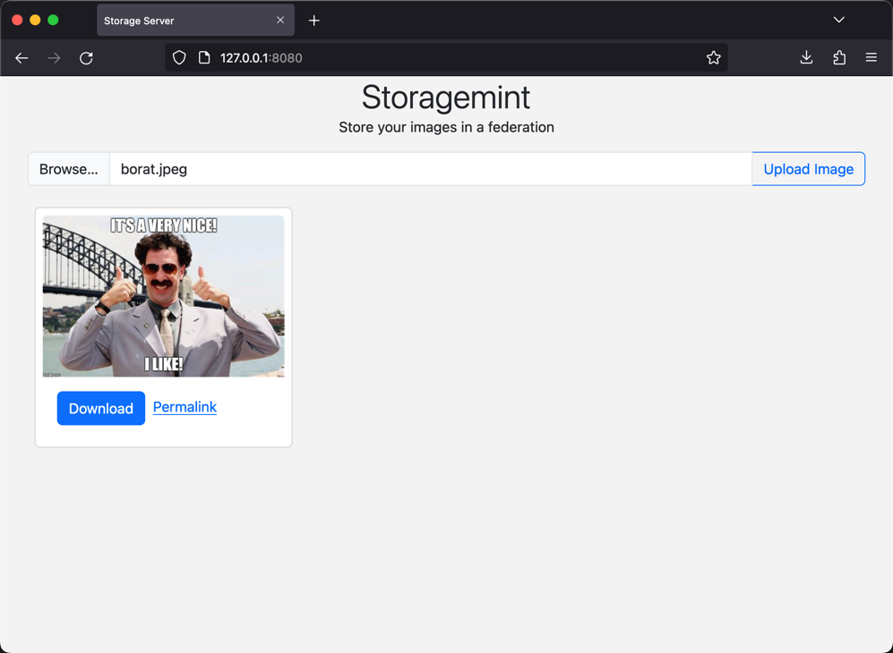

# Abstract
The storage-module adds a storage layer to fedimint. It can be used to store images, videos, documents, etc. Files can either be stored and retrieved by a command line client (cli) or by using the storage-server. The storage-server crate provides a Rest-API and a simple web interface to access the storage-module.

Possible usecases are:
* Store profilepics, memes and other images that are publicly available
* Backup important documents like contracts, invoices, sharded private keys, etc.
* Let the users pay using lightning


# Installation
Clone the repo and run the tmuxinator script to start the federation:
```
git clone https://github.com/ngutech21/fedimint.git
cd  fedimint
nix develop
./scripts/tmuxinator.sh
```


# Usage
## CLI
Store a file in the federation by using the cli
```
fedimint-cli store-data dummy.txt
```
returns a key 
{
  "key": "17fc82aa-d3f1-478c-947d-aa2736578ec2"
}


retrieve a previously stored file by using the cli. First argument is the key and then the output file
```
fedimint-cli get-data 17fc82aa-d3f1-478c-947d-aa2736578ec2 output.txt
```


## Storage-Server
The storage-server is a http server that can be used to store and retrieve files. It is a simple wrapper around the client-module and provides a Rest-API and a simple web interface to access the storage-module.


```
cd storage-server
cargo run
```
open browser and go to http://localhost:8080


